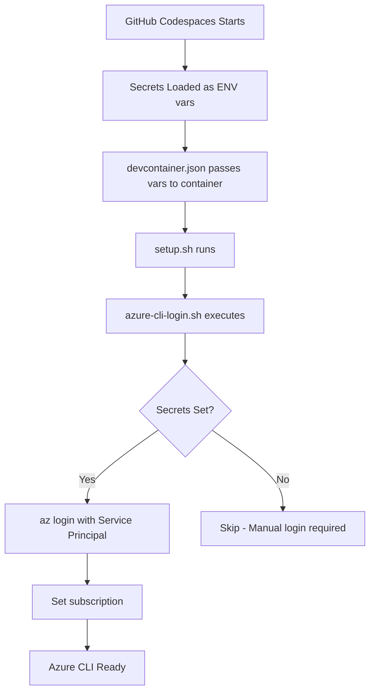

# Azure CLI Auto-Login Setup - Summary

## What Was Configured

Automatic authentication for GitHub Codespaces using Service Principal credentials and Terraform Cloud integration.

## Configured Services

### 1. Azure CLI Authentication ✅

Automatic Azure CLI login using Service Principal credentials.

### 2. Terraform Cloud Authentication ✅

Automatic Terraform CLI configuration for Terraform Cloud/Enterprise integration.

## Files Created/Modified

### Created Files

1. **`.devcontainer/azure-cli-login.sh`**
   - Bash script that authenticates Azure CLI using ARM environment variables
   - Runs automatically when devcontainer starts
   - Provides detailed logging and error handling

2. **`.devcontainer/test-azure-auth.sh`**
   - Test script to verify Azure CLI authentication
   - Checks environment variables and Azure access
   - Can be run manually to troubleshoot issues

3. **`.devcontainer/terraform-cli-login.sh`** 🆕
   - Configures Terraform CLI credentials for Terraform Cloud
   - Creates `~/.terraform.d/credentials.tfrc.json`
   - Uses TF_API_TOKEN from GitHub Codespaces secrets

4. **`.devcontainer/test-terraform-auth.sh`** 🆕
   - Test script to verify Terraform Cloud authentication
   - Checks credentials file and API connectivity
   - Lists accessible workspaces

5. **`docs/Codespaces-Auto-Azure-CLI-Login.md`**
   - Comprehensive documentation for Azure CLI setup
   - Setup instructions and troubleshooting guide
   - Security best practices

6. **`docs/Codespaces-Terraform-Cloud-Auth.md`** 🆕
   - Comprehensive documentation for Terraform Cloud setup
   - API token configuration and usage examples
   - Integration with Azure authentication

### Modified Files

1. **`.devcontainer/devcontainer.json`**
   - Added ARM environment variables to `containerEnv`
   - Added TF_API_TOKEN and TF_CLOUD_ORGANIZATION 🆕
   - Passes GitHub Codespaces secrets to container

2. **`.devcontainer/devcontainer.codespaces.json`** 🆕
   - Added TF_API_TOKEN secret definition
   - Added TF_CLOUD_ORGANIZATION secret definition
   - Documented all optional and required secrets

3. **`.devcontainer/setup.sh`**
   - Added Azure CLI authentication step
   - Added Terraform CLI configuration step 🆕
   - Calls login scripts during setup
   - Updated completion message to show auth status

## How It Works



## Required GitHub Codespaces Secrets

Set these at: <https://github.com/settings/codespaces>

### Azure Authentication

| Secret | Description | Required |
|--------|-------------|----------|
| `ARM_CLIENT_ID` | Service Principal Application ID | Yes |
| `ARM_CLIENT_SECRET` | Service Principal Secret | Yes |
| `ARM_TENANT_ID` | Azure AD Tenant ID | Yes |
| `ARM_SUBSCRIPTION_ID` | Target Azure Subscription ID | Yes |

### Terraform Cloud Authentication 🆕

| Secret | Description | Required |
|--------|-------------|----------|
| `TF_API_TOKEN` | Terraform Cloud API Token | Optional |
| `TF_CLOUD_ORGANIZATION` | Terraform Cloud Organization | Optional |

> **Note**: Terraform Cloud secrets are optional. Set them if you want to use Terraform Cloud features like remote state, remote execution, and policy enforcement.

## Testing the Setup

### Option 1: Rebuild Devcontainer (Recommended)

1. In VS Code Command Palette (F1): `Codespaces: Rebuild Container`
2. Wait for container to rebuild
3. Check terminal output for Azure CLI authentication messages
4. Verify with: `az account show`

### Option 2: Manual Test

Run the test script:

```bash
bash .devcontainer/test-azure-auth.sh
```

### Option 3: Quick Verification

```bash
# Check if authenticated
az account show

# List resource groups
az group list --output table
```

## Troubleshooting

### Secrets Not Working

If environment variables are empty:

```bash
# Check if variables are set
env | grep ARM_

# If empty, check GitHub settings and rebuild container
```

### Authentication Fails

Re-run the login script manually:

```bash
bash .devcontainer/azure-cli-login.sh
```

### Wrong Subscription

Set the correct subscription:

```bash
az account set --subscription $ARM_SUBSCRIPTION_ID
```

## Security Notes

✅ **What's Secure:**

- Secrets stored in GitHub Codespaces (encrypted)
- Environment variables only visible in your Codespace
- Service Principal with limited permissions

⚠️ **Best Practices:**

- Use least-privilege Service Principal
- Rotate secrets regularly
- Never commit secrets to git
- Use repository-specific secrets when possible

## Integration Benefits

These same environment variables work with:

- ✅ **Azure CLI** - Automatic login (configured)
- ✅ **Terraform** - No additional config needed
- ✅ **PowerShell Az Module** - Use `Connect-AzureServicePrincipal.ps1`
- ✅ **GitHub Actions** - Same secret names work in workflows

## Next Steps

1. **Set GitHub Codespaces Secrets** (if not done)
   - Visit: <https://github.com/settings/codespaces>
   - Add all four ARM_* secrets

2. **Rebuild Codespace**
   - Command Palette → `Codespaces: Rebuild Container`

3. **Verify Authentication**
   - Run: `bash .devcontainer/test-azure-auth.sh`

4. **Start Working**
   - Azure CLI is ready
   - Terraform will use same credentials
   - No manual login needed

## Quick Reference Commands

### Azure CLI

```bash
# Check authentication
az account show

# Test Azure access
az group list --output table

# Re-authenticate manually
bash .devcontainer/azure-cli-login.sh

# Run test script
bash .devcontainer/test-azure-auth.sh

# View environment variables (safe)
env | grep ARM_ | grep -v SECRET
```

### Terraform Cloud 🆕

```bash
# Check Terraform CLI configuration
cat ~/.terraform.d/credentials.tfrc.json

# Test Terraform Cloud API
curl -H "Authorization: Bearer $TF_API_TOKEN" \
  https://app.terraform.io/api/v2/account/details

# Re-configure Terraform credentials
bash .devcontainer/terraform-cli-login.sh

# Run Terraform Cloud test
bash .devcontainer/test-terraform-auth.sh

# Initialize with Terraform Cloud
terraform init

# List workspaces
terraform workspace list
```

## Documentation

- **Azure CLI Setup**: [`docs/Codespaces-Auto-Azure-CLI-Login.md`](../docs/Codespaces-Auto-Azure-CLI-Login.md)
- **Terraform Cloud Setup**: [`docs/Codespaces-Terraform-Cloud-Auth.md`](../docs/Codespaces-Terraform-Cloud-Auth.md) 🆕

## Support

For issues or questions:

1. Check the troubleshooting section in the documentation
2. Run the test scripts:
   - Azure: `bash .devcontainer/test-azure-auth.sh`
   - Terraform: `bash .devcontainer/test-terraform-auth.sh`
3. Review logs during devcontainer creation
4. Verify secrets are set at GitHub Codespaces settings

---

**Created**: October 2025  
**Last Updated**: October 2025
